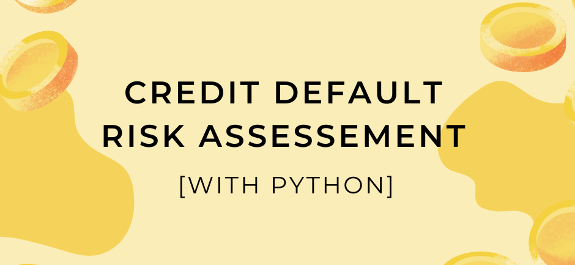

  

[***Click here to download detailed EDA Report***](https://github.com/manuethomas/Credit-Default-Risk-Analysis-EDA/blob/main/EDA%20Report/Credit%20Default%20Risk%20Assesment%20Report.pdf)

## Problem Statement

This project aims to analyze the loan application dataset by Home Credit Group and identify factors that significantly contribute to loan defaults. Specfically the project seeks to

- Understand the structure, content, and quality of the loan application dataset.
- Identify key demographic, financial, and application-related factors that are significantly associated with loan defaults.
- Examine the distribution of individual variables and investigate relationships between pairs of variables, focusing on those that correlate with loan defaults.
- Provide actionable recommendations to improve risk assessment and optimize the lending portfolio.

## Approach

- Understanding the business requirments
- Import relevant libraries
- Load the dataset
- Data Preprocessing 
    - Handling missing values
    - Outlier Treatment
- Exploratory Data Analysis 
    - Univariate Analysis (Categorical)
    - Correlation Between Numerical Variables
    - Univariate Analysis (numerical)
    - Bivariate Analysis
    - Scope for Further Analysis
- Key Takeaways and recommendations

## Exploratory Data Analysis

### Univariate Analysis (Categorical)

- Share of each loan category and the default rates
- Loan default rates based on gender
- Loan default based on who accompanied the client
- Indepth analysis between client profile (income type, education, family status, housing type, occupation) and loan default
- Commercial clients: distribution, default percentages

### Univariate Analysis (numerical)

- Analysis of credit amounts: median, distribution, anomalies
- Nature of relationship between client income and default rates
- Most common annuity amounts
- Distribution of Asset value in case of both default and non-default

### Bivariate Analysis

- Realtionship between credit amount and asset valuation
- Safest Credit ranged based on client income and asset valuation
- Relation between client income and credit amount
- Variation in credit amount based on family strength

## Key Takeaways and Recommendations

- Targeting:
    - **Low-Risk Groups**: Widows, married individuals, those with higher education, accountants,commercial clients with office apartments, and clients who own a house or apartment.
    - **High-Risk Groups**: Unemployed individuals, mothers on maternity leave, those with lower secondary education, people in civil marriages, single people, people who rent, low-skill laborers, clients who live with parents, clients from transport, industry types 3 and 8.
- Urgent policy adjustments needed for clients on maternity leave either through enhanced credit mechanisms or social security measures.
- Introducing new schemes and benefits to unemployed individuals aimed at upskilling them for employment and debt repayment
- More room to grow by increasing focus on commercial clients
- Among consumer clients those owning a house/apartment are the safest target group
- Safest Credit Range: Total income greater than $150,000 and Credit Amount between 2 million and 2.5 million